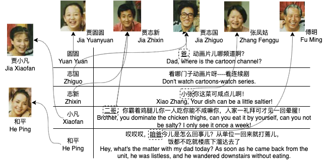
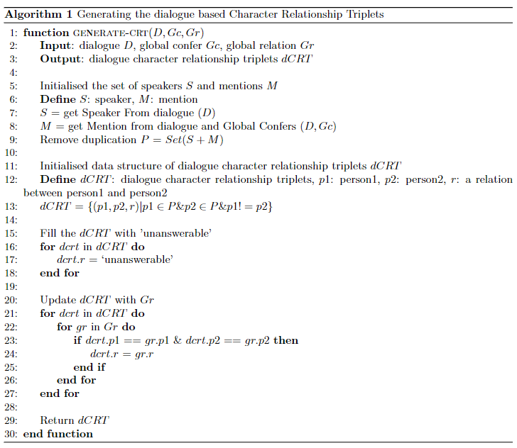
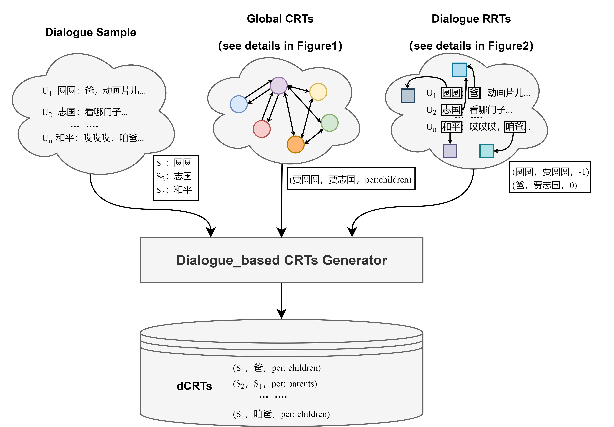
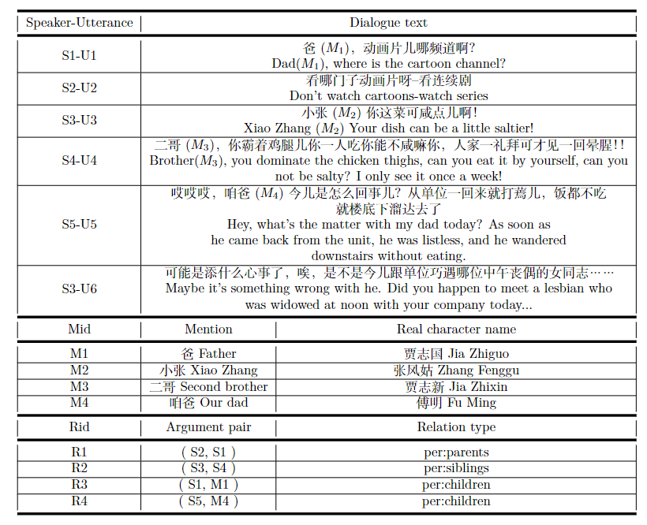
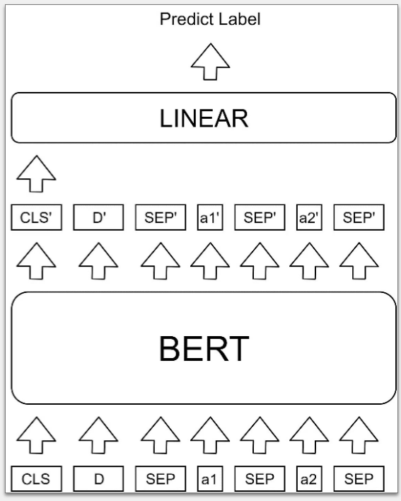

# CRECIL
The CRECIL Corpus: a New Dataset for Extraction of Relations between Characters in Chinese Multi-party Dialogues

本项目提出并描述了一个新的可自由使用的中文多方对话数据集，用于自动提取基于对话的角色关系。这些数据是从中国情景喜剧《我爱我家》(I Love My Home)的原始电视剧本中提取出来的，该电视剧以复杂的家庭为基础，用中文进行自然的对话。我们引入了基于全局角色关系图和对话角色指代关系的人工标注方法，生成了对话角色关系三元组。我们发现，在实际的汉语会话中提取人物关系比在英语会话中更具挑战性。

本项目的目录结构分为[Orginal_data](#a1)，[My_home_data](#a2)，[Final_data](#a3)，[bert](#a4)四个文件夹，具体介绍如下：

```
├─ Final_data/: train/dev/test data
├─ My_home_data/: generate CRTs in dialogue and CRTs data
├─ Orginal_data/: preprocessed data conclude Gc & Gr
├─ bert/: source model codes
├─ some pictures
├─ README.md
```


#### **⭐️<span id = "a1">Orginal_data</span>**

Orginal_data的目录结构如下，存储了本项目所标注的指代数据和关系数据，共标注了121个角色实体，30种角色与角色之间关系，以及8282条全局指代关系。

```
├─ Orginal_data/: 
    ├─ relation/:
    	├─ only_relation.pkl
    	├─ only_relation.txt
    	├─ relation.pkl
    	├─ relation.txt
    ├─ My_home.json
```

其中**My_home.json** 文件中包含了本文所标注的全局指代信息，Json文件的格式如下所示，其中character_entities存储了本文关键的指代信息**（Relation Reference Tripe，RRT）**, ```corefer∈Gc，RRT=(A′, A, P)```, A′代表在话语中的角色指代词，A代表真实的角色名称，P代表在当前话语中指代词出现的位置用于定位，例：第一句中（爸，贾志国，0）。



```json
{
    "episodes": [
        {
            "episode_id": "Episode_id",
            "scenes": [
                {
                    "scene_id": "Scene_id",
                    "utterances": [
                 		{
                            "utterance_id":        "Utterance_id",
                            "speakers":            "Speaker_name",
                            "transcript":          "Utterance_text",
                            "tokens":              "Utterance_token",
                            "character_entities":  "Global confers"
                        },
                        "...(other utterances)"
                    ]
                }
            ]
            "... (other scenes)"
        }
    ]
    "...(other episodes)"
}
```


另外**relation**子目录下包含四个文件，其中：only_relation 存储全局角色关系类型（Global relation，Gr），relation存储全局角色关系三元组（**Character Relation Triple，CRT**）。


```
## only_relation.pkl
{
	id1: relation_type1,
	...(other relation_types)
}

## relation.pkl
{
	(character1, character2): relation_type1,
	...(other CRTs)
}
```


#### **⭐️<span id = "a2">My_home_data</span>**

该文件夹下保存了本项目生成CRT三元组的过程以及将源文件经过的格式处理化后的数据信息。

```
├─ My_home_data/: 
	├─ exportCRT.py
    ├─ final.json
```

其中exportCRT.py为本文生成角色关系三元组（CRT）的策略，伪代码如下所示。



生成角色关系三元组之后，将对话和角色关系三元组拼接，共同构建成完整的数据。数据处理流程图如下图所示。



final.json为最终格式化处理后的数据，数据格式如下所示。

```
[
  [
    [
      dialogue 1 / turn 1,
      dialogue 1 / turn 2,
      ...(other dialogue turns)
    ],
    [
      {
        "x": argument 1,
        "y": argument 2,
        "r": [
          relation,
        ],
        "rid": [
          relation_id,
        ]
      },
      ...(other CRTs in dialogue)
    ],
    [
      {
      	"":ep,
      	"speaker"
      },
      ...(other RRTs in dialogue)
    ]
  ],
  ...(other dialogues, CRTS and RRTs)
]
```


#### **⭐️<span id = "a3">Final_Data</span>**

Final_data文件夹下保存了本项目划分数据集的代码以及划分数据集的结果。

```
├─ Final_data/: 
	├─ shuffle_data.py
    ├─ train.json
    ├─ dev.json
    ├─ test.json
```

该其中shuffle_data.py为划分数据集的策略，数据按照7:2:1划分，train.json, dev.json以及test.json为本文所使用的实验数据。



#### **⭐️<span id = "a4">bert</span>**

该文件夹下保存了本文所使用的对话关系抽取模型的相关代码，参考DialogRE数据集提供的基线模型。模型结构图如下图所示。



实验环境：

```
pytorch1.7  python3.8
```

运行模型：

```python
python run_classifier.py
```

验证模型：

```python
python evaluate.py
```


